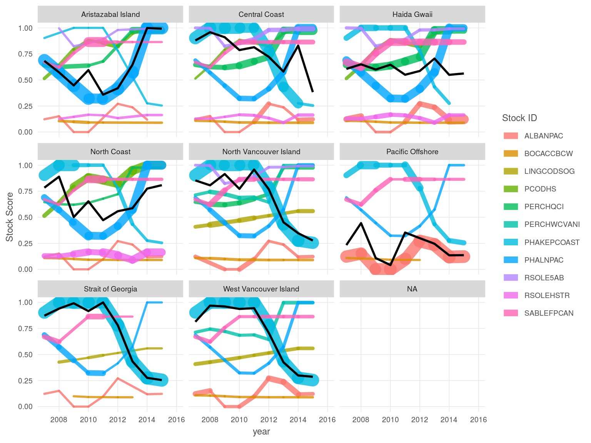
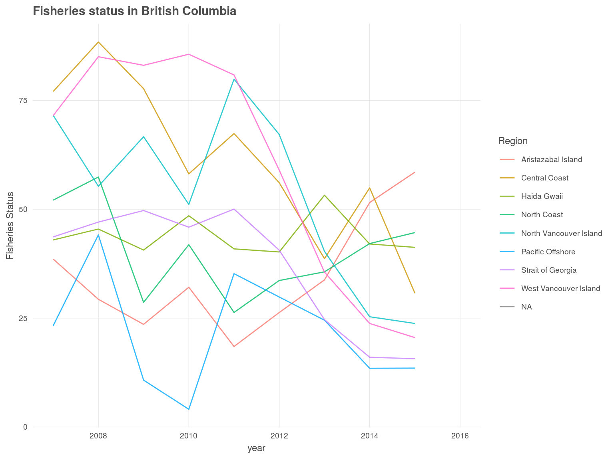

```{r setup, include=FALSE}
knitr::opts_chunk$set(echo = TRUE, message = F, warning = F)
```

# Base Model

- No penalty for unassessed catch
- No underfishing penalty
- No catch weighting
<br>
<br>


<br>
<br>
<br>

<br>
<br>
<br>
---

# Scenario 1: Apply a penalty for unassessed catch

The proportion of catch that is assessed, meaning it has at least a B/Bmsy metric, is calculated for every year using the Year in Review data.
<br>
<br>
<br>

<br>
<br>
<br>
This is then applied to the fisheries status in the following way:

score + (score*penalty) / 2
<br>
<br>
<br>

<br>
<br>
<br>
---

#Scenario 2: Remove the underfishing penalty

For this scenario, all stocks that are **underfished** and experiencing **underfishing** are given a stock score equal to 1, so no penalty for either underfishing or being underfished.
<br>
<br>
<br>

<br>
<br>
<br>

<br>
<br>
<br>
---

#Scenario 3: Weight scores by catch

This final scenario weights stock scores by the total proportional catch in each region.
<br>
<br>
<br>

<br>
<br>
<br>


